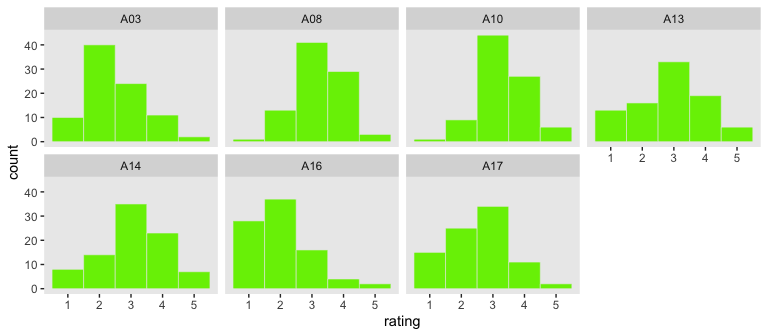
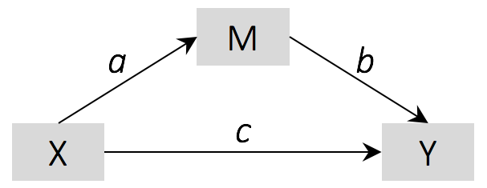
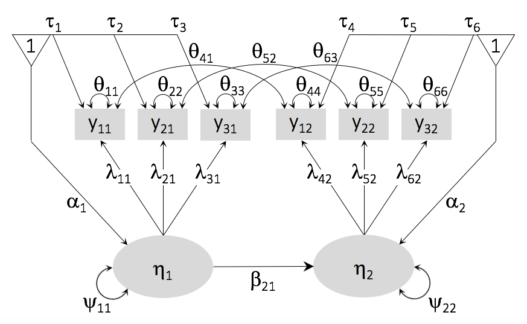
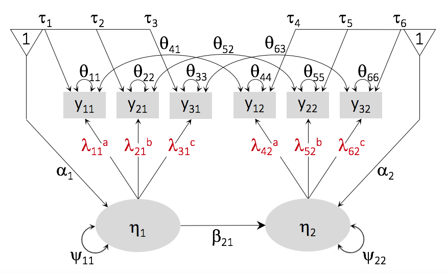
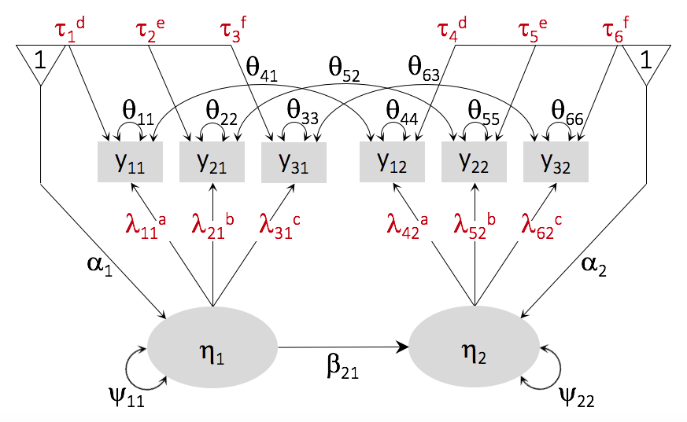
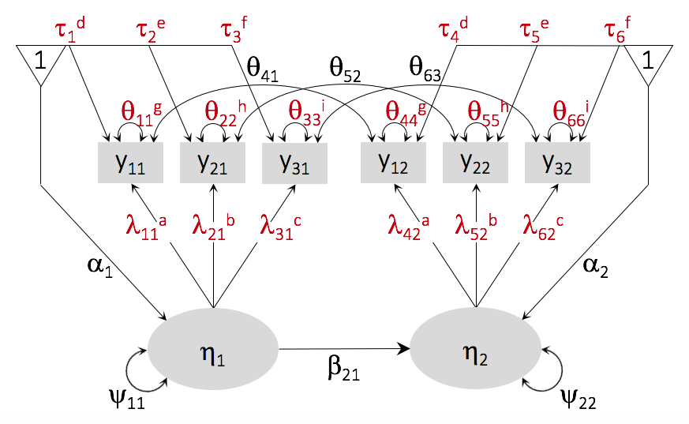

# The P-Technique with lavaan

The purpose of this document is to demonstrate how to fit single-case
structural equation models (SEMs) within the p-technique framework. As
discussed in the primary manuscript, among the recent introductions to
and tutorials on the p-technique family, we believe the method outlined
in [Little’s (2013)
text](https://www.guilford.com/books/Longitudinal-Structural-Equation-Modeling/Todd-Little/9781462510160)
is the most thorough and approachable for non-statistician behavioral
researchers. Thus, the approach described herein is based primarily on
Little’s text.

Here we open our first few packages and load the data.

``` r
library(readxl)
library(tidyverse)
library(lubridate)

d <- 
  read_excel("Lindsey.xlsx") %>% 
  mutate(Date = ymd(Date))
```

In this document, we’ll use functions and syntax from the
[tidyverse](https://www.tidyverse.org), which you might learn about
[here](http://r4ds.had.co.nz/transform.html) or
[here](http://style.tidyverse.org).

Here we take a glance at the structure of the data.

``` r
glimpse(d)
```

    ## Observations: 103
    ## Variables: 9
    ## $ Date <date> 2016-01-29, 2016-01-30, 2016-01-31, 2016-02-01, 2016-02-02, 2016-02-03, 2016-0…
    ## $ Meds <dbl> 1, NA, NA, NA, 1, 1, 1, NA, NA, 0, 1, 1, 1, 1, NA, 0, 1, 1, 1, 1, 1, 1, NA, 0, …
    ## $ A3   <dbl> 3, NA, NA, NA, 4, 3, 5, NA, NA, 4, 3, 3, 3, 4, NA, 4, 3, 4, 3, 2, 3, 2, NA, 4, …
    ## $ A8   <dbl> 3, NA, NA, NA, 2, 4, 5, NA, NA, 4, 3, 4, 4, 4, NA, 5, 4, 4, 4, 4, 4, 2, NA, 3, …
    ## $ A10  <dbl> 5, NA, NA, NA, 3, 5, 3, NA, NA, 3, 4, 3, 4, 3, NA, 4, 3, 5, 3, 2, 3, 2, NA, 4, …
    ## $ A13  <dbl> 4, NA, NA, NA, 5, 4, 4, NA, NA, 2, 4, 4, 3, 3, NA, 1, 4, 5, 5, 2, 3, 2, NA, 2, …
    ## $ A14  <dbl> 5, NA, NA, NA, 4, 5, 4, NA, NA, 3, 4, 4, 4, 3, NA, 2, 4, 5, 5, 3, 3, 2, NA, 3, …
    ## $ A16  <dbl> 3, NA, NA, NA, 2, 1, 1, NA, NA, 2, 2, 2, 2, 2, NA, 1, 2, 2, 3, 2, 1, 1, NA, 1, …
    ## $ A17  <dbl> 3, NA, NA, NA, 1, 2, 3, NA, NA, 1, 3, 3, 4, 3, NA, 4, 3, 4, 3, 2, 3, 2, NA, 3, …

These daily-diary data are from one participant, who we’ll refer to by
the pseudonym “Lindsey.” The nine columns in the data are composed of
three primary types of variables. `Date` contains a sequential list of
the dates from the beginning to the end of the study. The next column,
`Meds`, is a dummy variable indicating whether Lindsey took her
prescribed AHDH medication that day (i.e., coded 0 = “no”, 1 = “yes”).
The remaining columns, `A3` through `A17`, contain her responses to
seven of the [18 ASRS
items](https://www.ncbi.nlm.nih.gov/pubmed/15841682). At the beginning
of the study, Lindsey indicated these seven items represented her most
salient ADHD symptoms. Because this was a daily-diary study, we reworded
the items and their anchors to make sense in a daily context. The five
Likert-type anchor were labeled

  - 0 (*Not at all*)
  - 1 (*A little*)
  - 2 (*Moderately*)
  - 3 (*Most of the time*)
  - 4 (*All day long*)

Lindsey’s items were worded as follows:

  - Was it difficult concentrating on what people said to you, even when
    they spoke to you directly?
  - Were you distracted by activities or noises around you?
  - Did you fidget or squirm with your hands or your feet when sitting
    down?
  - Was it difficult unwinding or relaxing when you had time to
    yourself?
  - Did you feel overly active or compelled to do things, like you were
    driven by a motor?
  - Did you finish the sentences of other people before they could
    finish them themselves?
  - Was it difficult waiting your turn in when you were supposed to?

Note how the data are in the long format. That is, although we have one
participant, Lindsey, her data are presented in 103 rows, each
corresponding to a different calendar day.

## Descriptive statistics

If you wanted to get a sense of the distributions of the ASRS items,
histograms might be handy.

``` r
d %>% 
  select(A3:A17) %>% 
  rename(A03 = A3,
         A08 = A8) %>% 
  gather(item, rating) %>% 
  
  ggplot(aes(x = rating)) +
  geom_histogram(binwidth = 1, fill = "chartreuse2", color = "grey92", size = 1/5) +
  theme(panel.grid = element_blank()) +
  facet_wrap(~item, ncol = 4)
```

<!-- -->

Happily, their distributions look reasonable. You can get a sense of
their values over time with a sequentially-color-coded tile plot.

``` r
d %>% 
  select(Date, A3:A17) %>% 
  rename(A03 = A3,
         A08 = A8) %>% 
  gather(item, rating, -Date) %>%
  mutate(rating = factor(rating, levels = c(1:5))) %>% 
  
  ggplot(aes(x = Date, y = item)) +
  geom_tile(aes(fill = rating)) +
  scale_fill_viridis_d(NULL, option = "D",
                     guide = guide_legend(direction = "horizontal",
                                          nrow = 1)) +
  scale_x_date(NULL, expand = c(0, 0)) +
  scale_y_discrete(NULL, expand = c(0, 0)) +
  theme(panel.grid      = element_blank(),
        axis.ticks.y    = element_blank(),
        axis.text.y     = element_text(hjust = 0),
        legend.position = "top")
```

<!-- -->

And with the [psych
package](https://cran.r-project.org/web/packages/psych/index.html), we
can use the `describe()` function to get the typical descriptive
statistics.

``` r
library(psych)

d %>% 
  select(A3:A17) %>% 
  describe()
```

    ##     vars  n mean   sd median trimmed  mad min max range  skew kurtosis   se
    ## A3     1 87 2.48 0.94      2    2.45 1.48   1   5     4  0.51    -0.17 0.10
    ## A8     2 87 3.23 0.79      3    3.25 1.48   1   5     4 -0.14    -0.19 0.08
    ## A10    3 87 3.32 0.80      3    3.32 0.00   1   5     4  0.05     0.10 0.09
    ## A13    4 87 2.87 1.13      3    2.87 1.48   1   5     4 -0.09    -0.72 0.12
    ## A14    5 87 3.08 1.06      3    3.11 1.48   1   5     4 -0.22    -0.44 0.11
    ## A16    6 87 2.02 0.95      2    1.92 1.48   1   5     4  0.91     0.69 0.10
    ## A17    7 87 2.54 1.00      3    2.52 1.48   1   5     4  0.10    -0.55 0.11

If you look at the tile plot, above, you’ll note the several light-gray
stripes. Those are occasions for missing values. Here’s the breakdown of
missing values on the ASRS items by count and percent.

``` r
d %>% 
  mutate(missing = is.na(A10)) %>% 
  group_by(missing) %>% 
  count() %>% 
  ungroup() %>% 
  mutate(percent = 100 * n / sum(n)) %>% 
  mutate_if(is.double, round, digits = 1)
```

    ## # A tibble: 2 x 3
    ##   missing     n percent
    ##   <lgl>   <int>   <dbl>
    ## 1 FALSE      87    84.5
    ## 2 TRUE       16    15.5

Recall that the items in the ASRS correspond to the [18 criterion A
symptoms](https://www.cdc.gov/ncbddd/adhd/diagnosis.html), with the
first nine classified as Inattentive and the last nine as
Hyperactive/Impulsive. For the sake of this example, we’ll focus on
Lindsey’s Hyperactive/Impulsive items, ASRS items 10, 13, 14, 16, and
17. The following code drops the other two.

``` r
d <-
  d %>% 
  select(everything(), -A3, -A8)
```

## P-technique CFAs

Here we open our primary statistical package,
[lavaan](https://cran.r-project.org/web/packages/lavaan/index.html),
which you might learn more about
[here](https://dornsife.usc.edu/assets/sites/210/docs/GC3/lavaan_tutorial.pdf)
or [here](http://lavaan.ugent.be/tutorial/index.html).

``` r
library(lavaan)
```

Next we will proceed to show how to perform the analyses reported in the
main manuscript. Those are:

1.  0-lag p-technique CFA
2.  1-lag dynamic p-technique CFA
3.  1-lag dynamic p-technique SEM with a covariate
4.  1-lag dynamic p-technique longitudinal mediation

### *0-lag*.

A simple starting place is a p-technique confirmatory factor analysis
(CFA). Using this approach, the model syntax looks much like that of a
typical group-level CFA. First, we specify the model, which we call
`CFA_0_lag`. We define our sole factor `H` by the five items. By
default, lavaan fixes the first loading of each factor to 1 in order to
set the latent scale. With the `NA*A10` syntax, we relax that
constraint, allowing lavaan to freely estimate all loadings.
Correspondingly, we used the `H ~~ 1*H` syntax to set the latent
variance to 1, which then sets the scale of the latent by putting it in
a standardized metric.

The way one scales a factor is largely a matter of taste. Interested
readers might learn more about the three most common methods in [Little,
Slegers, and Card’s (2006)
article](http://www.agencylab.ku.edu/~agencylab/manuscripts/\(Little,%20Slegers,%20Card,%202006\).pdf)
on the topic. We use the fixed factor method, here, to aid the
interpretation of the effects in subsequent models.

``` r
CFA_0_lag <- '
H =~ NA*A10 + A13 + A14 + A16 + A17

# Standardize the variance
H ~~ 1*H
'
```

Now we’ve defined the model, here we estimate the parameters. Note we’ve
selected a robust estimator with the `estimator = "MLR"` syntax. The
lavaan package offers a [variety of
estimators](http://lavaan.ugent.be/tutorial/est.html), in addition to
conventional maximum likelihood. With the `missing = "ML"` syntax,
you’ll note we’re also handling the missing data with full information
maximum likelihood (FIML) under the typical missing at random (MAR)
assumption. As our p-technique models are just special cases of SEM, all
of the modern missing data techniques (e.g., auxiliary variables with
the saturated-correlates approach, multiple imputation) are available.
For an approachable introduction to contemporary missing data methods,
see [Enders’ (2010) text, *Applied missing data
analysis*](http://www.appliedmissingdata.com). As our primary focus in
this project is practicing with the p-technique models, we’ll keep
things simple and just use FIML.

``` r
fit.CFA_0_lag <- 
  cfa(CFA_0_lag, 
      data = d,
      estimator = "MLR",
      missing = "ML")
```

Now we use the `summary()` function to return the results, including the
typical fit indices and 95% CIs for good measure.

``` r
summary(fit.CFA_0_lag, 
        fit.measures = T,
        standardized = T,
        ci = T)
```

    ## lavaan 0.6-3 ended normally after 16 iterations
    ## 
    ##   Optimization method                           NLMINB
    ##   Number of free parameters                         15
    ## 
    ##                                                   Used       Total
    ##   Number of observations                            87         103
    ##   Number of missing patterns                         1
    ## 
    ##   Estimator                                         ML      Robust
    ##   Model Fit Test Statistic                       7.452       6.768
    ##   Degrees of freedom                                 5           5
    ##   P-value (Chi-square)                           0.189       0.238
    ##   Scaling correction factor                                  1.101
    ##     for the Yuan-Bentler correction (Mplus variant)
    ## 
    ## Model test baseline model:
    ## 
    ##   Minimum Function Test Statistic              123.262     105.281
    ##   Degrees of freedom                                10          10
    ##   P-value                                        0.000       0.000
    ## 
    ## User model versus baseline model:
    ## 
    ##   Comparative Fit Index (CFI)                    0.978       0.981
    ##   Tucker-Lewis Index (TLI)                       0.957       0.963
    ## 
    ##   Robust Comparative Fit Index (CFI)                         0.983
    ##   Robust Tucker-Lewis Index (TLI)                            0.965
    ## 
    ## Loglikelihood and Information Criteria:
    ## 
    ##   Loglikelihood user model (H0)               -548.428    -548.428
    ##   Scaling correction factor                                  1.061
    ##     for the MLR correction
    ##   Loglikelihood unrestricted model (H1)       -544.702    -544.702
    ##   Scaling correction factor                                  1.071
    ##     for the MLR correction
    ## 
    ##   Number of free parameters                         15          15
    ##   Akaike (AIC)                                1126.856    1126.856
    ##   Bayesian (BIC)                              1163.845    1163.845
    ##   Sample-size adjusted Bayesian (BIC)         1116.515    1116.515
    ## 
    ## Root Mean Square Error of Approximation:
    ## 
    ##   RMSEA                                          0.075       0.064
    ##   90 Percent Confidence Interval          0.000  0.179       0.000  0.167
    ##   P-value RMSEA <= 0.05                          0.295       0.354
    ## 
    ##   Robust RMSEA                                               0.067
    ##   90 Percent Confidence Interval                             0.000  0.180
    ## 
    ## Standardized Root Mean Square Residual:
    ## 
    ##   SRMR                                           0.049       0.049
    ## 
    ## Parameter Estimates:
    ## 
    ##   Information                                 Observed
    ##   Observed information based on                Hessian
    ##   Standard Errors                   Robust.huber.white
    ## 
    ## Latent Variables:
    ##                    Estimate  Std.Err  z-value  P(>|z|) ci.lower ci.upper   Std.lv  Std.all
    ##   H =~                                                                                    
    ##     A10               0.222    0.099    2.237    0.025    0.027    0.417    0.222    0.279
    ##     A13               1.063    0.104   10.252    0.000    0.860    1.266    1.063    0.947
    ##     A14               0.885    0.102    8.659    0.000    0.684    1.085    0.885    0.840
    ##     A16               0.056    0.107    0.523    0.601   -0.153    0.265    0.056    0.059
    ##     A17               0.488    0.107    4.574    0.000    0.279    0.697    0.488    0.492
    ## 
    ## Intercepts:
    ##                    Estimate  Std.Err  z-value  P(>|z|) ci.lower ci.upper   Std.lv  Std.all
    ##    .A10               3.322    0.085   38.973    0.000    3.155    3.489    3.322    4.178
    ##    .A13               2.874    0.120   23.879    0.000    2.638    3.109    2.874    2.560
    ##    .A14               3.080    0.113   27.291    0.000    2.859    3.302    3.080    2.926
    ##    .A16               2.023    0.101   19.934    0.000    1.824    2.222    2.023    2.137
    ##    .A17               2.540    0.106   23.885    0.000    2.332    2.749    2.540    2.561
    ##     H                 0.000                               0.000    0.000    0.000    0.000
    ## 
    ## Variances:
    ##                    Estimate  Std.Err  z-value  P(>|z|) ci.lower ci.upper   Std.lv  Std.all
    ##     H                 1.000                               1.000    1.000    1.000    1.000
    ##    .A10               0.583    0.088    6.591    0.000    0.409    0.756    0.583    0.922
    ##    .A13               0.130    0.163    0.799    0.424   -0.189    0.449    0.130    0.103
    ##    .A14               0.326    0.126    2.577    0.010    0.078    0.574    0.326    0.294
    ##    .A16               0.893    0.162    5.498    0.000    0.575    1.211    0.893    0.997
    ##    .A17               0.746    0.126    5.929    0.000    0.500    0.993    0.746    0.758

The measures of model fit generally look good. We might note, however,
that since this model has a small number of degrees of freedom (i.e.,
\(df = 5\)), the RMSEA is of limited utility, here. For more on the
topic, see [Kenney, Kaniskan, and McCoach
(2015)](https://www.researchgate.net/publication/274053733_The_Performance_of_RMSEA_in_Models_With_Small_Degrees_of_Freedom).
But RMSEA aside, the model \(\chi_{MLR}^2\) (\(6.77, p = .24\)) and the
CFI (\(.98\)) both look great.

If you inspect the `Std.all` column, you’ll see that for Lindsey, items
10 and 16 have very low standardized loadings. Results like this are
where p-technique methods shine. Though both items have high loadings in
group-level factor analyses, those results do not necessarily hold for
individuals. Even though Lindsey selected both items as among her
primary ADHD concerns, they provide little information to her
hyperactive factor.

The p-technique literature is surfeit with analyses showing the mismatch
between group-based factor structures and those of single-case data. For
introductions to the topic, consider [Fisher, Medaglia, and Jeronimus
(2018)](https://www.pnas.org/content/pnas/early/2018/06/15/1711978115.full.pdf)
or [Molenaar and Campbell
(2009)](https://journals.sagepub.com/doi/pdf/10.1111/j.1467-8721.2009.01619.x).

### *1-lag*.

#### *First, we need to process the data a bit*.

Before we proceed to fit a dynamic p-technique CFA, we’ll need to lag
our data file. In short, a lag is the difference from one measurement
occasion to another. The duration of a lag will depend on study design.
From the clinical process literature, for example, lags have ranged from
utterance to utterance to the span between therapy sessions ([Russell,
Jones, &
Miller, 2007](https://www.researchgate.net/publication/247575796_Core_process_components_in_psychotherapy_A_synthetic_review_of_P-technique_studies)).
As Lindsey’s data are from a daily-diary study, each lag is a day in
separation.

Before we lag the data file, we’ll add a row to the end of the data.
Because this row corresponds to `Date = "2016-05-11"`, a day for which
we don’t have any information other than it was a Wednesday, we’ll
insert `NA`s (i.e., [the default code for missing values in
R](https://www.rdocumentation.org/packages/base/versions/3.5.2/topics/NA))
into most of the columns.

``` r
d_lagged <-
  tibble(Date = ymd("2016-01-18"), 
         Meds = NA, 
         A10 = NA, A13 = NA, A14 = NA, A16 = NA, A17 = NA) %>% 
  bind_rows(d)
```

With the `lead()` function, we’ll add lagged values for our `Meds` dummy
and our ASRS items. For each of the lagged columns, we’ll add the suffix
`_1` to help differentiate them from the original columns.

``` r
d_lagged <-
  d_lagged %>% 
  mutate(Meds_1 = lead(Meds),
         A10_1  = lead(A10),
         A13_1  = lead(A13),
         A14_1  = lead(A14),
         A16_1  = lead(A16),
         A17_1  = lead(A17))
```

Here are what the data look like.

``` r
glimpse(d_lagged)
```

    ## Observations: 104
    ## Variables: 13
    ## $ Date   <date> 2016-01-18, 2016-01-29, 2016-01-30, 2016-01-31, 2016-02-01, 2016-02-02, 2016…
    ## $ Meds   <dbl> NA, 1, NA, NA, NA, 1, 1, 1, NA, NA, 0, 1, 1, 1, 1, NA, 0, 1, 1, 1, 1, 1, 1, N…
    ## $ A10    <dbl> NA, 5, NA, NA, NA, 3, 5, 3, NA, NA, 3, 4, 3, 4, 3, NA, 4, 3, 5, 3, 2, 3, 2, N…
    ## $ A13    <dbl> NA, 4, NA, NA, NA, 5, 4, 4, NA, NA, 2, 4, 4, 3, 3, NA, 1, 4, 5, 5, 2, 3, 2, N…
    ## $ A14    <dbl> NA, 5, NA, NA, NA, 4, 5, 4, NA, NA, 3, 4, 4, 4, 3, NA, 2, 4, 5, 5, 3, 3, 2, N…
    ## $ A16    <dbl> NA, 3, NA, NA, NA, 2, 1, 1, NA, NA, 2, 2, 2, 2, 2, NA, 1, 2, 2, 3, 2, 1, 1, N…
    ## $ A17    <dbl> NA, 3, NA, NA, NA, 1, 2, 3, NA, NA, 1, 3, 3, 4, 3, NA, 4, 3, 4, 3, 2, 3, 2, N…
    ## $ Meds_1 <dbl> 1, NA, NA, NA, 1, 1, 1, NA, NA, 0, 1, 1, 1, 1, NA, 0, 1, 1, 1, 1, 1, 1, NA, 0…
    ## $ A10_1  <dbl> 5, NA, NA, NA, 3, 5, 3, NA, NA, 3, 4, 3, 4, 3, NA, 4, 3, 5, 3, 2, 3, 2, NA, 4…
    ## $ A13_1  <dbl> 4, NA, NA, NA, 5, 4, 4, NA, NA, 2, 4, 4, 3, 3, NA, 1, 4, 5, 5, 2, 3, 2, NA, 2…
    ## $ A14_1  <dbl> 5, NA, NA, NA, 4, 5, 4, NA, NA, 3, 4, 4, 4, 3, NA, 2, 4, 5, 5, 3, 3, 2, NA, 3…
    ## $ A16_1  <dbl> 3, NA, NA, NA, 2, 1, 1, NA, NA, 2, 2, 2, 2, 2, NA, 1, 2, 2, 3, 2, 1, 1, NA, 1…
    ## $ A17_1  <dbl> 3, NA, NA, NA, 1, 2, 3, NA, NA, 1, 3, 3, 4, 3, NA, 4, 3, 4, 3, 2, 3, 2, NA, 3…

Let’s focus on the last four rows to take a closer look at what we’ve
done. Here we’ll just consider the `Date` and the original and lagged
versions of items 10 and 13.

``` r
d_lagged %>% 
  select(Date, A10:A13, A10_1:A13_1) %>%
  slice(c(101:104)) %>% 
  knitr::kable()
```

| Date       | A10 | A13 | A10\_1 | A13\_1 |
| :--------- | --: | --: | -----: | -----: |
| 2016-05-07 |   3 |   1 |      2 |      2 |
| 2016-05-08 |   2 |   2 |      3 |      3 |
| 2016-05-09 |   3 |   3 |      2 |      3 |
| 2016-05-10 |   2 |   3 |     NA |     NA |

Notice how the values of `A10` and `A13` in one row are always the same
as `A10_1` and `A13_1` in the row above them. That’s because when we
created the lagged variables, those with the `_1` suffixes, we took the
values from the original columns and shifted them up one. As such, the
new lagged columns always have missing values in their last row. Because
we did not collect data from Lindsey on May 11, we have no values to on
her ASRS items to shift up one and insert into the lagged columns for
May 10.

In principle, we could add more lags. [Kim, Nesselroade, and McCullough
(2009)](https://link.springer.com/article/10.1007/s10804-009-9062-2),
for example, used a 2-lag structure in their study on worldview,
self-concept, and physical health in older individuals. For our present
analysis, you might consider the original columns as depicting the data
at *lag 0* and the new lagged columns as depicting the data at *lag 1*.
Conceptually, lag 0 corresponds to “today” and lag 1 to “tomorrow.” That
is, the 1-lag data structure for daily-diary data allows to ask
questions about how today will predict or influence tomorrow. If this is
still confusing, see Little’s (2013) text, particularly his Figure 7.7
and the prose surrounding it. This should also become more clear with a
little practice.

#### *We digress into measurement theory*.

Now we have our lagged data, `d_lagged`, we are almost ready to specify
and fit the 1-lag CFA model.

Because of the way the data are copied to create a lagged dataset, model
estimation involving multiple lags entails a number of specific
constraints because the information across the lags is essentially
equivalent (Little, 2013). These constraints are all connected to the
issue of measurement invariance. Typical group-level longitudinal CFAs
require that analysts assess the extent to which the factors are
invariant across time (for detailed discussions, see
[Brown, 2015](https://www.guilford.com/books/Confirmatory-Factor-Analysis-for-Applied-Research/Timothy-Brown/9781462515363);
Little, 2013;
[Newsom, 2015](https://www.routledge.com/Longitudinal-Structural-Equation-Modeling-A-Comprehensive-Introduction/Newsom/p/book/9781848726970);
[Widaman, Ferrer, &
Conger, 2010](https://www.ncbi.nlm.nih.gov/pmc/articles/PMC2848495/pdf/nihms144397.pdf)).
Factorial invariance across time suggests the variables of interest were
reliably measured across time and that the constructs themselves were
stable. For dynamic p-technique models, we expect “strict factorial
invariance” (Little, 2013), which entails that the item loadings, item
intercepts, and residual variances are equivalent across lags.

We will specify those constraints using parameter labels in the code
that follows. If you are new to measurement invariance within the SEM
context, we provide a brief walk-through at the end of this document.
But for a more thorough introduction, do consult the references, above.

#### *Finally, we’re ready to specify and estimate the model*.

Within lavaan, assigning two or more parameters the same label will
constrain them to equality. For example, consider the loading code,
below. In it, we define the lag-0 factor with the following: `H0 =~
l1*A10 + l2*A13 + l3*A14 + l4*A16 + l5*A17`. With the `l[i]*` prefixes,
we labeled the loading of ASRS item 10 as `l1`, the loading for item 13
as `l2`, and so on. If you look at the second line, you’ll see we used
the same parameter labels for the lag-1 items. In this way, we constrain
the loadings of the same items to equality across lags. We followed the
same approach for the item intercepts and residual variances.

The particular names you use for your labels are, of course, arbitrary.
We could have named our first loading `dog` if we wanted to. Buy our
stance is it makes sense to serially name parameters in the order they
come in (e.g., `l1`, `l2`, …) and to give groups of parameters the same
prefix (e.g., `l` for loadings, `i` for intercepts). Doing so can help
prevent typos.

``` r
CFA_1_lag <- '
# loadings
H0 =~ l1*A10   + l2*A13   + l3*A14   + l4*A16   + l5*A17
H1 =~ l1*A10_1 + l2*A13_1 + l3*A14_1 + l4*A16_1 + l5*A17_1

# item intercepts
A10 ~ i1*1
A13 ~ i2*1
A14 ~ i3*1
A16 ~ i4*1
A17 ~ i5*1

A10_1 ~ i1*1
A13_1 ~ i2*1
A14_1 ~ i3*1
A16_1 ~ i4*1
A17_1 ~ i5*1

# residual variances
A10 ~~ rv1*A10
A13 ~~ rv2*A13
A14 ~~ rv3*A14
A16 ~~ rv4*A16
A17 ~~ rv5*A17

A10_1 ~~ rv1*A10_1
A13_1 ~~ rv2*A13_1
A14_1 ~~ rv3*A14_1
A16_1 ~~ rv4*A16_1
A17_1 ~~ rv5*A17_1

# cross-lag residual covariances
A10 ~~ A10_1
A13 ~~ A13_1
A14 ~~ A14_1
A16 ~~ A16_1
A17 ~~ A17_1

# structural model
H1 ~ H0

# latent variances
H0 ~~ 1*H0
H1 ~~ NA*H1  # Because of the structural model, this residual variance is freely estimated

# latent means/intercepts
H0 ~ 0
H1 ~ 1  # Because of the structural model, this latent intercept is freely estimated
'
```

We fit the model, here.

``` r
fit.CFA_1_lag <- 
  cfa(CFA_1_lag, 
      data = d_lagged,
      estimator = "MLR",
      missing = "ML",
      std.lv = T)
```

Now inspect the summary.

``` r
summary(fit.CFA_1_lag, 
        fit.measures = T,
        standardized = T,
        ci = T)
```

    ## lavaan 0.6-3 ended normally after 37 iterations
    ## 
    ##   Optimization method                           NLMINB
    ##   Number of free parameters                         38
    ##   Number of equality constraints                    15
    ## 
    ##                                                   Used       Total
    ##   Number of observations                           100         104
    ##   Number of missing patterns                         3
    ## 
    ##   Estimator                                         ML      Robust
    ##   Model Fit Test Statistic                      31.919      31.394
    ##   Degrees of freedom                                42          42
    ##   P-value (Chi-square)                           0.870       0.884
    ##   Scaling correction factor                                  1.017
    ##     for the Yuan-Bentler correction (Mplus variant)
    ## 
    ## Model test baseline model:
    ## 
    ##   Minimum Function Test Statistic              290.043     266.514
    ##   Degrees of freedom                                45          45
    ##   P-value                                        0.000       0.000
    ## 
    ## User model versus baseline model:
    ## 
    ##   Comparative Fit Index (CFI)                    1.000       1.000
    ##   Tucker-Lewis Index (TLI)                       1.044       1.051
    ## 
    ##   Robust Comparative Fit Index (CFI)                         1.000
    ##   Robust Tucker-Lewis Index (TLI)                            1.048
    ## 
    ## Loglikelihood and Information Criteria:
    ## 
    ##   Loglikelihood user model (H0)              -1083.604   -1083.604
    ##   Scaling correction factor                                  0.676
    ##     for the MLR correction
    ##   Loglikelihood unrestricted model (H1)      -1067.644   -1067.644
    ##   Scaling correction factor                                  1.052
    ##     for the MLR correction
    ## 
    ##   Number of free parameters                         23          23
    ##   Akaike (AIC)                                2213.208    2213.208
    ##   Bayesian (BIC)                              2273.127    2273.127
    ##   Sample-size adjusted Bayesian (BIC)         2200.487    2200.487
    ## 
    ## Root Mean Square Error of Approximation:
    ## 
    ##   RMSEA                                          0.000       0.000
    ##   90 Percent Confidence Interval          0.000  0.036       0.000  0.033
    ##   P-value RMSEA <= 0.05                          0.981       0.984
    ## 
    ##   Robust RMSEA                                               0.000
    ##   90 Percent Confidence Interval                             0.000  0.034
    ## 
    ## Standardized Root Mean Square Residual:
    ## 
    ##   SRMR                                           0.076       0.076
    ## 
    ## Parameter Estimates:
    ## 
    ##   Information                                 Observed
    ##   Observed information based on                Hessian
    ##   Standard Errors                   Robust.huber.white
    ## 
    ## Latent Variables:
    ##                    Estimate  Std.Err  z-value  P(>|z|) ci.lower ci.upper   Std.lv  Std.all
    ##   H0 =~                                                                                   
    ##     A10       (l1)    0.219    0.068    3.200    0.001    0.085    0.352    0.219    0.275
    ##     A13       (l2)    1.056    0.091   11.558    0.000    0.877    1.235    1.056    0.940
    ##     A14       (l3)    0.895    0.076   11.849    0.000    0.747    1.043    0.895    0.848
    ##     A16       (l4)    0.050    0.080    0.621    0.535   -0.107    0.207    0.050    0.052
    ##     A17       (l5)    0.488    0.080    6.129    0.000    0.332    0.644    0.488    0.491
    ##   H1 =~                                                                                   
    ##     A10_1     (l1)    0.219    0.068    3.200    0.001    0.085    0.352    0.218    0.275
    ##     A13_1     (l2)    1.056    0.091   11.558    0.000    0.877    1.235    1.056    0.940
    ##     A14_1     (l3)    0.895    0.076   11.849    0.000    0.747    1.043    0.895    0.848
    ##     A16_1     (l4)    0.050    0.080    0.621    0.535   -0.107    0.207    0.050    0.052
    ##     A17_1     (l5)    0.488    0.080    6.129    0.000    0.332    0.644    0.488    0.491
    ## 
    ## Regressions:
    ##                    Estimate  Std.Err  z-value  P(>|z|) ci.lower ci.upper   Std.lv  Std.all
    ##   H1 ~                                                                                    
    ##     H0                0.511    0.117    4.378    0.000    0.282    0.740    0.511    0.511
    ## 
    ## Covariances:
    ##                    Estimate  Std.Err  z-value  P(>|z|) ci.lower ci.upper   Std.lv  Std.all
    ##  .A10 ~~                                                                                  
    ##    .A10_1            -0.065    0.080   -0.818    0.413   -0.221    0.091   -0.065   -0.112
    ##  .A13 ~~                                                                                  
    ##    .A13_1            -0.068    0.071   -0.962    0.336   -0.207    0.071   -0.068   -0.460
    ##  .A14 ~~                                                                                  
    ##    .A14_1            -0.039    0.074   -0.527    0.598   -0.184    0.106   -0.039   -0.124
    ##  .A16 ~~                                                                                  
    ##    .A16_1             0.170    0.140    1.217    0.224   -0.104    0.445    0.170    0.190
    ##  .A17 ~~                                                                                  
    ##    .A17_1             0.220    0.106    2.080    0.038    0.013    0.427    0.220    0.294
    ## 
    ## Intercepts:
    ##                    Estimate  Std.Err  z-value  P(>|z|) ci.lower ci.upper   Std.lv  Std.all
    ##    .A10       (i1)    3.316    0.058   57.605    0.000    3.203    3.429    3.316    4.174
    ##    .A13       (i2)    2.842    0.117   24.266    0.000    2.612    3.071    2.842    2.528
    ##    .A14       (i3)    3.052    0.105   29.125    0.000    2.846    3.257    3.052    2.891
    ##    .A16       (i4)    2.026    0.078   25.882    0.000    1.873    2.180    2.026    2.138
    ##    .A17       (i5)    2.526    0.091   27.672    0.000    2.348    2.705    2.526    2.545
    ##    .A10_1     (i1)    3.316    0.058   57.605    0.000    3.203    3.429    3.316    4.174
    ##    .A13_1     (i2)    2.842    0.117   24.266    0.000    2.612    3.071    2.842    2.528
    ##    .A14_1     (i3)    3.052    0.105   29.125    0.000    2.846    3.257    3.052    2.891
    ##    .A16_1     (i4)    2.026    0.078   25.882    0.000    1.873    2.180    2.026    2.138
    ##    .A17_1     (i5)    2.526    0.091   27.672    0.000    2.348    2.705    2.526    2.545
    ##     H0                0.000                               0.000    0.000    0.000    0.000
    ##    .H1                0.052    0.121    0.427    0.669   -0.185    0.289    0.052    0.052
    ## 
    ## Variances:
    ##                    Estimate  Std.Err  z-value  P(>|z|) ci.lower ci.upper   Std.lv  Std.all
    ##    .A10      (rv1)    0.584    0.065    9.000    0.000    0.456    0.711    0.584    0.924
    ##    .A13      (rv2)    0.148    0.098    1.515    0.130   -0.044    0.339    0.148    0.117
    ##    .A14      (rv3)    0.314    0.080    3.912    0.000    0.157    0.471    0.314    0.282
    ##    .A16      (rv4)    0.896    0.122    7.317    0.000    0.656    1.136    0.896    0.997
    ##    .A17      (rv5)    0.748    0.097    7.745    0.000    0.559    0.937    0.748    0.758
    ##    .A10_1    (rv1)    0.584    0.065    9.000    0.000    0.456    0.711    0.584    0.924
    ##    .A13_1    (rv2)    0.148    0.098    1.515    0.130   -0.044    0.339    0.148    0.117
    ##    .A14_1    (rv3)    0.314    0.080    3.912    0.000    0.157    0.471    0.314    0.282
    ##    .A16_1    (rv4)    0.896    0.122    7.317    0.000    0.656    1.136    0.896    0.997
    ##    .A17_1    (rv5)    0.748    0.097    7.745    0.000    0.559    0.937    0.748    0.759
    ##     H0                1.000                               1.000    1.000    1.000    1.000
    ##    .H1                0.738    0.156    4.734    0.000    0.433    1.044    0.739    0.739

The model fits the data great. You’ll note that the autoregressive
parameter, `H1 ~ H0`, is about .5. The metric is standardized and
suggests that a one-unit increase in Lindsey’s ASRS ratings, today,
would predict about a half unit increase, tomorrow. You might interpret
this as a carryover effect, or a kind of behavioral inertia (see
[Hamaker, Asparouhov, Brose, Schmiedek, &
Muthén, 2018](https://www.tandfonline.com/doi/full/10.1080/00273171.2018.1446819)).

As an aside, you might also note that now our degrees of freedom are
large enough (i.e., \(df = 42\)) that the RMSEA should be more
informative (Kenney et al., 2015). For example, the width of its upper
90% CI is much more narrow than it was in the first model. Happily, the
RMSEA coheres with the other fit statistics, which all suggest the model
fits the data well.

## Dynamic-p SEM part 1: Adding a covariate

Here we move from measurement model concerns to include a covariate.
With the data in hand, we can use `Meds_1` to predict lag-1 ADHD values,
`H1`, while still controlling for the previous day’s ADHD values (i.e.,
`H1 ~ H0`). We continue to impose the same measurement invariance
constraints from before.

``` r
SEM_1_lag <- '
# loadings
H0 =~ l1*A10   + l2*A13   + l3*A14   + l4*A16   + l5*A17
H1 =~ l1*A10_1 + l2*A13_1 + l3*A14_1 + l4*A16_1 + l5*A17_1

# item intercepts
A10 ~ i1*1
A13 ~ i2*1
A14 ~ i3*1
A16 ~ i4*1
A17 ~ i5*1

A10_1 ~ i1*1
A13_1 ~ i2*1
A14_1 ~ i3*1
A16_1 ~ i4*1
A17_1 ~ i5*1

# residual variances
A10 ~~ rv1*A10
A13 ~~ rv2*A13
A14 ~~ rv3*A14
A16 ~~ rv4*A16
A17 ~~ rv5*A17

A10_1 ~~ rv1*A10_1
A13_1 ~~ rv2*A13_1
A14_1 ~~ rv3*A14_1
A16_1 ~~ rv4*A16_1
A17_1 ~~ rv5*A17_1

# cross-lag residual covariances
A10 ~~ A10_1
A13 ~~ A13_1
A14 ~~ A14_1
A16 ~~ A16_1
A17 ~~ A17_1

# structural model
H1 ~ H0 + Meds_1

# latent variances
H0 ~~ 1*H0
H1 ~~ NA*H1  # Because of the structural model, this residual variance is freely estimated

# latent means/intercepts
H0 ~ 0
H1 ~ 1  # Because of the structural model, this latent intercept is freely estimated
'
```

Fit the model.

``` r
fit.SEM_1_lag <- 
  cfa(SEM_1_lag, 
      data = d_lagged,
      estimator = "MLR",
      missing = "ML",
      std.lv = T)
```

Now we summarize.

``` r
summary(fit.SEM_1_lag, 
        fit.measures = T,
        standardized = T,
        ci = T)
```

    ## lavaan 0.6-3 ended normally after 39 iterations
    ## 
    ##   Optimization method                           NLMINB
    ##   Number of free parameters                         39
    ##   Number of equality constraints                    15
    ## 
    ##                                                   Used       Total
    ##   Number of observations                            87         104
    ##   Number of missing patterns                         2
    ## 
    ##   Estimator                                         ML      Robust
    ##   Model Fit Test Statistic                      52.201      51.923
    ##   Degrees of freedom                                51          51
    ##   P-value (Chi-square)                           0.427       0.438
    ##   Scaling correction factor                                  1.005
    ##     for the Yuan-Bentler correction (Mplus variant)
    ## 
    ## Model test baseline model:
    ## 
    ##   Minimum Function Test Statistic              328.939     308.051
    ##   Degrees of freedom                                55          55
    ##   P-value                                        0.000       0.000
    ## 
    ## User model versus baseline model:
    ## 
    ##   Comparative Fit Index (CFI)                    0.996       0.996
    ##   Tucker-Lewis Index (TLI)                       0.995       0.996
    ## 
    ##   Robust Comparative Fit Index (CFI)                         0.997
    ##   Robust Tucker-Lewis Index (TLI)                            0.996
    ## 
    ## Loglikelihood and Information Criteria:
    ## 
    ##   Loglikelihood user model (H0)               -975.687    -975.687
    ##   Scaling correction factor                                  0.690
    ##     for the MLR correction
    ##   Loglikelihood unrestricted model (H1)       -949.587    -949.587
    ##   Scaling correction factor                                  1.043
    ##     for the MLR correction
    ## 
    ##   Number of free parameters                         24          24
    ##   Akaike (AIC)                                1999.374    1999.374
    ##   Bayesian (BIC)                              2058.556    2058.556
    ##   Sample-size adjusted Bayesian (BIC)         1982.828    1982.828
    ## 
    ## Root Mean Square Error of Approximation:
    ## 
    ##   RMSEA                                          0.016       0.014
    ##   90 Percent Confidence Interval          0.000  0.071       0.000  0.071
    ##   P-value RMSEA <= 0.05                          0.788       0.796
    ## 
    ##   Robust RMSEA                                               0.014
    ##   90 Percent Confidence Interval                             0.000  0.071
    ## 
    ## Standardized Root Mean Square Residual:
    ## 
    ##   SRMR                                           0.117       0.117
    ## 
    ## Parameter Estimates:
    ## 
    ##   Information                                 Observed
    ##   Observed information based on                Hessian
    ##   Standard Errors                   Robust.huber.white
    ## 
    ## Latent Variables:
    ##                    Estimate  Std.Err  z-value  P(>|z|) ci.lower ci.upper   Std.lv  Std.all
    ##   H0 =~                                                                                   
    ##     A10       (l1)    0.183    0.060    3.062    0.002    0.066    0.300    0.183    0.235
    ##     A13       (l2)    1.038    0.095   10.872    0.000    0.851    1.225    1.038    0.926
    ##     A14       (l3)    0.904    0.087   10.402    0.000    0.734    1.074    0.904    0.858
    ##     A16       (l4)    0.008    0.081    0.103    0.918   -0.150    0.167    0.008    0.009
    ##     A17       (l5)    0.454    0.083    5.473    0.000    0.291    0.617    0.454    0.457
    ##   H1 =~                                                                                   
    ##     A10_1     (l1)    0.183    0.060    3.062    0.002    0.066    0.300    0.177    0.228
    ##     A13_1     (l2)    1.038    0.095   10.872    0.000    0.851    1.225    1.002    0.921
    ##     A14_1     (l3)    0.904    0.087   10.402    0.000    0.734    1.074    0.872    0.849
    ##     A16_1     (l4)    0.008    0.081    0.103    0.918   -0.150    0.167    0.008    0.009
    ##     A17_1     (l5)    0.454    0.083    5.473    0.000    0.291    0.617    0.438    0.444
    ## 
    ## Regressions:
    ##                    Estimate  Std.Err  z-value  P(>|z|) ci.lower ci.upper   Std.lv  Std.all
    ##   H1 ~                                                                                    
    ##     H0                0.264    0.102    2.599    0.009    0.065    0.463    0.274    0.274
    ##     Meds_1            1.577    0.200    7.894    0.000    1.185    1.969    1.634    0.688
    ## 
    ## Covariances:
    ##                    Estimate  Std.Err  z-value  P(>|z|) ci.lower ci.upper   Std.lv  Std.all
    ##  .A10 ~~                                                                                  
    ##    .A10_1            -0.068    0.076   -0.892    0.372   -0.217    0.081   -0.068   -0.119
    ##  .A13 ~~                                                                                  
    ##    .A13_1            -0.025    0.071   -0.354    0.723   -0.165    0.115   -0.025   -0.142
    ##  .A14 ~~                                                                                  
    ##    .A14_1            -0.068    0.067   -1.012    0.312   -0.200    0.064   -0.068   -0.231
    ##  .A16 ~~                                                                                  
    ##    .A16_1             0.152    0.125    1.212    0.226   -0.094    0.397    0.152    0.180
    ##  .A17 ~~                                                                                  
    ##    .A17_1             0.227    0.113    1.999    0.046    0.004    0.449    0.227    0.290
    ## 
    ## Intercepts:
    ##                    Estimate  Std.Err  z-value  P(>|z|) ci.lower ci.upper   Std.lv  Std.all
    ##    .A10       (i1)    3.319    0.058   57.060    0.000    3.205    3.433    3.319    4.272
    ##    .A13       (i2)    2.825    0.127   22.224    0.000    2.576    3.074    2.825    2.520
    ##    .A14       (i3)    3.032    0.115   26.410    0.000    2.807    3.258    3.032    2.878
    ##    .A16       (i4)    2.008    0.078   25.670    0.000    1.855    2.162    2.008    2.191
    ##    .A17       (i5)    2.518    0.096   26.110    0.000    2.329    2.707    2.518    2.533
    ##    .A10_1     (i1)    3.319    0.058   57.060    0.000    3.205    3.433    3.319    4.280
    ##    .A13_1     (i2)    2.825    0.127   22.224    0.000    2.576    3.074    2.825    2.598
    ##    .A14_1     (i3)    3.032    0.115   26.410    0.000    2.807    3.258    3.032    2.953
    ##    .A16_1     (i4)    2.008    0.078   25.670    0.000    1.855    2.162    2.008    2.191
    ##    .A17_1     (i5)    2.518    0.096   26.110    0.000    2.329    2.707    2.518    2.551
    ##     H0                0.000                               0.000    0.000    0.000    0.000
    ##    .H1               -1.166    0.176   -6.632    0.000   -1.511   -0.821   -1.208   -1.208
    ## 
    ## Variances:
    ##                    Estimate  Std.Err  z-value  P(>|z|) ci.lower ci.upper   Std.lv  Std.all
    ##    .A10      (rv1)    0.570    0.068    8.392    0.000    0.437    0.703    0.570    0.945
    ##    .A13      (rv2)    0.178    0.097    1.843    0.065   -0.011    0.368    0.178    0.142
    ##    .A14      (rv3)    0.294    0.067    4.368    0.000    0.162    0.426    0.294    0.264
    ##    .A16      (rv4)    0.840    0.120    7.007    0.000    0.605    1.075    0.840    1.000
    ##    .A17      (rv5)    0.782    0.103    7.587    0.000    0.580    0.984    0.782    0.791
    ##    .A10_1    (rv1)    0.570    0.068    8.392    0.000    0.437    0.703    0.570    0.948
    ##    .A13_1    (rv2)    0.178    0.097    1.843    0.065   -0.011    0.368    0.178    0.151
    ##    .A14_1    (rv3)    0.294    0.067    4.368    0.000    0.162    0.426    0.294    0.279
    ##    .A16_1    (rv4)    0.840    0.120    7.007    0.000    0.605    1.075    0.840    1.000
    ##    .A17_1    (rv5)    0.782    0.103    7.587    0.000    0.580    0.984    0.782    0.803
    ##     H0                1.000                               1.000    1.000    1.000    1.000
    ##    .H1                0.421    0.106    3.958    0.000    0.213    0.630    0.452    0.452

The model fit the data well. Recall that the latent variables are in a
standardized metric. Because `Meds_1` is a dummy variable, this puts the
`H1 ~ Meds_1` coefficient in a Cohen’s \(d\) like metric. That is, we
just estimated a single-case effect size, along with 95% confidence
intervals, in a familiar metric.

## Dynamic-p SEM part 2: Longitudinal mediation

To demonstrate the flexibility of the dynamic p-technique SEM framework,
we might reparameterize the structural model to make a longitudinal
mediation model. We will continue to regress `H1` on both `H0` and
`Meds_1`. Now we also regress `Meds_1` on `H0`. Within that context, the
consider the typical mediation path
diagram.



If we are interested in quantifying the strength of the indirect effect
of \(X\) on \(Y\) through \(M\), we multiply the \(a\) and \(b\)
pathways. Because the sampling distribution of the \(ab\) coefficient is
not necessarily Gaussian, contemporary methodologists typically
recommend using the bootstrap to compute the 95% confidence intervals
rather than rely on analytic standard errors (e.g., [Hayes &
Rockwood, 2017](https://reader.elsevier.com/reader/sd/pii/S0005796716301887?token=88A7F6370B3BC1D9C162157418E77467F140B779DE8A0E2922DA5C602199371FB681DC979A2DB3EA50C7B3637AE2470C)).
All of this is [available with
lavaan](http://lavaan.ugent.be/tutorial/mediation.html).

Now consider our new structural model.

``` r
'
H1     ~ H0 + Meds_1
Meds_1 ~ H0
'
```

In this model, we might consider `H1` as the \(Y\) variable, `H0` as the
\(X\), and `Meds_1` as the mediator \(M\). As such, we might label the
parameters like so.

``` r
'
H1     ~ c*H0 + b*Meds_1
Meds_1 ~ a*H0
'
```

Now all we need to do is use the `:=` operator to define the `ab`
parameter and fit the model.

``` r
MED_1_lag <- '
# loadings
H0 =~ l1*A10   + l2*A13   + l3*A14   + l4*A16   + l5*A17
H1 =~ l1*A10_1 + l2*A13_1 + l3*A14_1 + l4*A16_1 + l5*A17_1

# item intercepts
A10 ~ i1*1
A13 ~ i2*1
A14 ~ i3*1
A16 ~ i4*1
A17 ~ i5*1

A10_1 ~ i1*1
A13_1 ~ i2*1
A14_1 ~ i3*1
A16_1 ~ i4*1
A17_1 ~ i5*1

# residual variances
A10 ~~ rv1*A10
A13 ~~ rv2*A13
A14 ~~ rv3*A14
A16 ~~ rv4*A16
A17 ~~ rv5*A17

A10_1 ~~ rv1*A10_1
A13_1 ~~ rv2*A13_1
A14_1 ~~ rv3*A14_1
A16_1 ~~ rv4*A16_1
A17_1 ~~ rv5*A17_1

# cross-lag residual covariances
A10 ~~ A10_1
A13 ~~ A13_1
A14 ~~ A14_1
A16 ~~ A16_1
A17 ~~ A17_1

# structural model
H1     ~ c*H0 + b*Meds_1
Meds_1 ~ a*H0

# latent variances
H0 ~~ 1*H0
H1 ~~ NA*H1  # Because of the structural model, this residual variance is freely estimated

# latent means/intercepts
H0 ~ 0
H1 ~ 1  # Because of the structural model, this latent intercept is freely estimated

# define the model constraint, the indirect effect
ab := a * b
'
```

The lavaan package offers at least [two ways to
bootstrap](http://lavaan.ugent.be/tutorial/est.html). Perhaps the
simplest is to include the `se = "bootstrap"` argument within the
`cfa()` or `sem()` functions. By default, it returns results from 1000
iterations. Note, however, that this requires we set `estimator = "ML"`.

``` r
fit.MED_1_lag <- 
  cfa(MED_1_lag, 
      data = d_lagged,
      estimator = "ML",
      missing = "ML",
      std.lv = T,
      se = "bootstrap")
```

Behold the summary.

``` r
summary(fit.MED_1_lag, 
        fit.measures = T,
        ci = T)
```

    ## lavaan 0.6-3 ended normally after 42 iterations
    ## 
    ##   Optimization method                           NLMINB
    ##   Number of free parameters                         42
    ##   Number of equality constraints                    15
    ## 
    ##                                                   Used       Total
    ##   Number of observations                           100         104
    ##   Number of missing patterns                         3
    ## 
    ##   Estimator                                         ML
    ##   Model Fit Test Statistic                      46.774
    ##   Degrees of freedom                                50
    ##   P-value (Chi-square)                           0.604
    ## 
    ## Model test baseline model:
    ## 
    ##   Minimum Function Test Statistic              360.130
    ##   Degrees of freedom                                55
    ##   P-value                                        0.000
    ## 
    ## User model versus baseline model:
    ## 
    ##   Comparative Fit Index (CFI)                    1.000
    ##   Tucker-Lewis Index (TLI)                       1.012
    ## 
    ## Loglikelihood and Information Criteria:
    ## 
    ##   Loglikelihood user model (H0)              -1104.120
    ##   Loglikelihood unrestricted model (H1)      -1080.733
    ## 
    ##   Number of free parameters                         27
    ##   Akaike (AIC)                                2262.240
    ##   Bayesian (BIC)                              2332.580
    ##   Sample-size adjusted Bayesian (BIC)         2247.307
    ## 
    ## Root Mean Square Error of Approximation:
    ## 
    ##   RMSEA                                          0.000
    ##   90 Percent Confidence Interval          0.000  0.057
    ##   P-value RMSEA <= 0.05                          0.910
    ## 
    ## Standardized Root Mean Square Residual:
    ## 
    ##   SRMR                                           0.088
    ## 
    ## Parameter Estimates:
    ## 
    ##   Standard Errors                            Bootstrap
    ##   Number of requested bootstrap draws             1000
    ##   Number of successful bootstrap draws            1000
    ## 
    ## Latent Variables:
    ##                    Estimate  Std.Err  z-value  P(>|z|) ci.lower ci.upper
    ##   H0 =~                                                                 
    ##     A10       (l1)    0.224    0.065    3.467    0.001    0.098    0.362
    ##     A13       (l2)    1.039    0.089   11.669    0.000    0.849    1.199
    ##     A14       (l3)    0.922    0.080   11.532    0.000    0.775    1.082
    ##     A16       (l4)    0.051    0.086    0.589    0.556   -0.117    0.228
    ##     A17       (l5)    0.480    0.080    5.992    0.000    0.312    0.624
    ##   H1 =~                                                                 
    ##     A10_1     (l1)    0.224    0.065    3.467    0.001    0.098    0.362
    ##     A13_1     (l2)    1.039    0.089   11.669    0.000    0.849    1.199
    ##     A14_1     (l3)    0.922    0.080   11.532    0.000    0.775    1.082
    ##     A16_1     (l4)    0.051    0.086    0.589    0.556   -0.117    0.228
    ##     A17_1     (l5)    0.480    0.080    5.992    0.000    0.312    0.624
    ## 
    ## Regressions:
    ##                    Estimate  Std.Err  z-value  P(>|z|) ci.lower ci.upper
    ##   H1 ~                                                                  
    ##     H0         (c)    0.266    0.122    2.185    0.029   -0.000    0.478
    ##     Meds_1     (b)    1.466    0.223    6.561    0.000    1.068    1.934
    ##   Meds_1 ~                                                              
    ##     H0         (a)    0.164    0.049    3.351    0.001    0.084    0.281
    ## 
    ## Covariances:
    ##                    Estimate  Std.Err  z-value  P(>|z|) ci.lower ci.upper
    ##  .A10 ~~                                                                
    ##    .A10_1            -0.070    0.083   -0.845    0.398   -0.254    0.064
    ##  .A13 ~~                                                                
    ##    .A13_1            -0.014    0.066   -0.206    0.837   -0.134    0.124
    ##  .A14 ~~                                                                
    ##    .A14_1            -0.076    0.062   -1.228    0.220   -0.208    0.033
    ##  .A16 ~~                                                                
    ##    .A16_1             0.169    0.149    1.135    0.256   -0.103    0.496
    ##  .A17 ~~                                                                
    ##    .A17_1             0.215    0.101    2.132    0.033   -0.058    0.329
    ## 
    ## Intercepts:
    ##                    Estimate  Std.Err  z-value  P(>|z|) ci.lower ci.upper
    ##    .A10       (i1)    3.314    0.056   59.709    0.000    3.240    3.464
    ##    .A13       (i2)    2.832    0.119   23.734    0.000    2.625    3.100
    ##    .A14       (i3)    3.042    0.108   28.041    0.000    2.853    3.266
    ##    .A16       (i4)    2.026    0.078   25.843    0.000    1.886    2.198
    ##    .A17       (i5)    2.523    0.086   29.235    0.000    2.434    2.764
    ##    .A10_1     (i1)    3.314    0.056   59.709    0.000    3.240    3.464
    ##    .A13_1     (i2)    2.832    0.119   23.734    0.000    2.625    3.100
    ##    .A14_1     (i3)    3.042    0.108   28.041    0.000    2.853    3.266
    ##    .A16_1     (i4)    2.026    0.078   25.843    0.000    1.886    2.198
    ##    .A17_1     (i5)    2.523    0.086   29.235    0.000    2.434    2.764
    ##     H0                0.000                               0.000    0.000
    ##    .H1               -1.078    0.189   -5.706    0.000   -1.527   -0.785
    ##    .Meds_1            0.777    0.045   17.337    0.000    0.678    0.854
    ## 
    ## Variances:
    ##                    Estimate  Std.Err  z-value  P(>|z|) ci.lower ci.upper
    ##    .A10      (rv1)    0.582    0.065    8.968    0.000    0.442    0.690
    ##    .A13      (rv2)    0.190    0.093    2.041    0.041    0.037    0.408
    ##    .A14      (rv3)    0.278    0.068    4.099    0.000    0.111    0.380
    ##    .A16      (rv4)    0.896    0.125    7.140    0.000    0.660    1.148
    ##    .A17      (rv5)    0.754    0.097    7.742    0.000    0.504    0.875
    ##    .A10_1    (rv1)    0.582    0.065    8.968    0.000    0.442    0.690
    ##    .A13_1    (rv2)    0.190    0.093    2.041    0.041    0.037    0.408
    ##    .A14_1    (rv3)    0.278    0.068    4.099    0.000    0.111    0.380
    ##    .A16_1    (rv4)    0.896    0.125    7.140    0.000    0.660    1.148
    ##    .A17_1    (rv5)    0.754    0.097    7.742    0.000    0.504    0.875
    ##     H0                1.000                               1.000    1.000
    ##    .H1                0.416    0.112    3.704    0.000    0.238    0.672
    ##    .Meds_1            0.150    0.022    6.980    0.000    0.103    0.186
    ## 
    ## Defined Parameters:
    ##                    Estimate  Std.Err  z-value  P(>|z|) ci.lower ci.upper
    ##     ab                0.241    0.086    2.807    0.005    0.119    0.455

Based on the model \(\chi^2\) and so forth, the model continues to fit
the data just fine. The `ab` parameter is small but with modestly narrow
intervals not overlapping zero. Here we have statistical evidence of a
single-case mediational process.

To be clear, this is not a theory-based model and we do not encourage
our readers to over interpret these results. But we do hope applied
researchers might find the example provocative. By combining sound
theory, carefully-collected single-case data, and the dynamic
p-technique framework, researchers can fit single-case mediation models
and more.

## You can model single-case contextual and longitudinal processes.

Consider again the challenge made by [Hayes and
colleagues](https://www.sciencedirect.com/science/article/pii/S000579671830158X):

> Individual human lives are contextual and longitudinal, as are the
> change processes that alter these life trajectories. From a
> process-based point of view, practitioners need coherent and broadly
> applicable models of change processes that are relevant for the
> individual in context, that provide increased treatment utility and
> intervention guidance, and that simplify human complexity. The most
> popular methodological and analytic tools in use in intervention
> science are not fully adequate to that task, even when they are turned
> in the direction of change processes. (p. 3)

We believe the p-technique framework may be up to the task.

Happy modeling.

## But what’s the deal with measurement invariance?

If you haven’t waded into the measurement invariance literature before,
their waters can seem deep and cold at first touch. But don’t recoil
just yet. The basic ideas are simple enough. In brief, we want to make
sure our tools (i.e., our self-report questionnaires) work the same
across contexts. If they do, we say we have measurement invariance,
which we generally like. If our tools work differently across contexts,
we say we have some degree of measurement variance.

With group-level data, researchers typically assess measurement
invariance in two contexts. First, when the data are cross-sectional,
researchers often ask whether a measure is invariant across two or more
groups. These are often demographic groups, such as subgroupings of sex
or ethnicity (e.g., [Melka, Lancaster, Bryant, &
Rodriguez, 2011](https://onlinelibrary.wiley.com/doi/pdf/10.1002/jclp.20836)).
Within the clinical literature, they are also often between clinical and
non-clinical samples (e.g., [Meganck, Vanheule, &
Desmet, 2008](https://journals.sagepub.com/doi/pdf/10.1177/1073191107306140)).
In the second context, measurement invariance may be assessed over
multiple assessment points in a longitudinal study (e.g., [Fried et
al., 2016](http://eiko-fried.com/wp-content/uploads/Fried_2016-04481-001.pdf)).
In this way, the question is to what extent the tool worked the same
over time.

In line with contemporary psychometrics, we usually assess measurement
invariance within the context of the latent variable framework. As such,
it’s often operationalized by the term *factorial invariance*. Let’s say
we have a given questionnaire, like the ASRS. The latent variable model
proposes we can describe the 18 ASRS items with a smaller number of
latent variables. In so doing, the model entails the items have loadings
(i.e., \(\lambda\)s), intercepts (i.e., \(\tau\)s), residual variances
(i.e., \(\theta\)s), and possibly residual covariances (i.e.,
\(\theta_{ij}\)s). It’s beyond the scope of this tutorial to expound on
these terms in depth. For that, the interested reader should consult an
introductory SEM textbook, such as those by Brown (2015) or [Kline
(2016)](https://www.guilford.com/books/Principles-and-Practice-of-Structural-Equation-Modeling/Rex-Kline/9781462523344).
But the point, here, is that if we wanted to assess whether the ASRS was
factorially invariant across two groups (e.g., boys and girls), we’d
assess whether those \(\lambda\)s, \(\tau\)s, and \(\theta\)s were the
same across the two groups.

There are other kinds of factorial invariance, too, such as invariance
of latent means, variances, and covariances. In principle, those can
apply to our p-technique framework. However, they are not applicable to
the models in this tutorial and in order to keep some semblance of
focus, we will not consider them further.

Factorial invariance can be thought of as on a continuum or gradation.
In practice, we typically assess factorial invariance by imposing a
sequence of increasingly strict equality constraints. The levels in this
sequence go by several names and there is some dispute among
psychometricians on how to order them. Here we present an approach
consistent with Little (2013) and Newsom (2015). The levels of factorial
invariance we will consider are:

1.  Configural invariance
2.  Weak invariance
3.  Strong invariance
4.  Strict invariance

We will start with configural invariance.

### *Configural invariance (i.e., invariance of gross structure)*.

To use a simple example, let’s say we have a 3-item questionnaire. We’ll
call those items \(y_1\), \(y_2\), and \(y_3\). Their content might be
for depression, ADHD, or whatever you like. Now say we’ve given our
brief questionnaire to the same group of people at two time points. Our
theory proposes we can measure those three items as defining a single
latent variable. Following common SEM notation, we’ll call that latent
variable \(\eta\). Let’s call those two time points were \(t = 1\) and
\(t = 2\). We can then differentiate our latent variable on those two
time points as \(\eta_1\) and \(\eta_2\). Accordingly, we can depict our
longitudinal SEM in the path diagrams in Figure 2,
below.



In the applied literature, SEM path diagrams aren’t usually this
detailed. To keep things simple, researchers often leave out the mean
structure—which we’ve depicted by the triangles and the associated
arrows showing the \(\tau\) parameters and the \(\alpha\) parameters.
Those depict the item intercepts and latent means, respectively.

For the sake of our factorial invariance discussion, the main thing to
notice is that both \(\eta_1\) and \(\eta_2\) are defined by the same
items, \(y_1\) through \(y_3\), but just at different time points. Thus,
\(y_{11}\) is the first item measured at \(t = 1\) and \(y_{12}\) is
that same item measured at \(t = 2\). Both latent variables have the
same general factor structure; they have the same number of item
loadings, which are connected to the same items. This condition is
termed *configural invariance*. You might think of this as the
foundation of all other levels of factorial invariance. If this
assumption isn’t tenable, well, you’ll have a lot to write about in your
discussion section.

We typically determine configural invariance is tenable if the overall
fit statistics (e.g., the model \(\chi^2\), the CFI) are within
reasonable ranges.

### *Weak invariance (i.e., invariance of the loadings)*.

Assuming configural invariance holds, which is typical but not a
guarantee (see Fried et al., 2016), the next step is to test for *weak
factorial invariance*–invariance across loadings. Continuing on with our
3-item example, in this step we would specify the following constraints:
\(\lambda_{11} = \lambda_{12}\), \(\lambda_{21} = \lambda_{22}\), and
\(\lambda_{31} = \lambda_{32}\). We have depicted those constraints in
Figure 3. Note how the \(\lambda\)s are all colored red. This is just to
bring them to attention. More importantly, notice how both
\(\lambda_{11}\) and \(\lambda_{12}\) have the \(a\) superscript. This
is just to indicate that their values are constrained to equality. The
same relationship is also true for the other two items across
time.



If the model fit statistics do not degrade substantially after including
these constraints, we generally determine weak measurement invariance
holds. There is continuing debate in the psychometric literature on how
stringent analysts should be when assessing model fit degradation, as
well as which fit statistics are the best ones to consult. But those
discussions are beyond the scope of this tutorial. Any of the text books
(e.g., Newsom, 2015) or methodological papers (e.g., Widaman et al.,
2010) we have already mentioned are fine starting points for those
topics.

### *Strong invariance (i.e., invariance of item intercepts)*.

Generally speaking, though not necessarily (see Newsom, 2015), analysts
next proceed to assess whether the item intercepts are invariant.
Invariance across item intercepts is often termed *strong factorial
invariance*. This is less often examined in the applied literature,
though see [Neumann, van Lier, Gratz, and Koot
(2010)](https://journals.sagepub.com/doi/pdf/10.1177/1073191109349579)
for an example. We depict these constraints in Figure
4.



In addition to the \(\lambda\) constraints carried over from the weak
invariance model, our strong invariance model added the constraints
that: \(\tau_1 = \tau_4\), \(\tau_2 = \tau_5\), and \(\tau_3 = \tau_6\).
That is, now our first item, \(y_1\), has the same intercept at both
\(t = 1\) and \(t = 2\). The same holds for \(y_2\) and \(y_3\). If the
model fit does not degrade past our chosen threshold, we declare strong
factorial invariance.

In many applications, this is the desired level of factorial invariance
to declare the items measure the same constructs across the groups
and/or time points under consideration. However, we can take one more
step.

### *Strict invariance (i.e., invariance of residual variances)*.

Residual variances are the parts of the item variances that are not
explained by the latent variable, \(\eta\). In classical test theory,
these are considered pure measurement error ([Lord &
Novick, 1968](http://psycnet.apa.org/record/1968-35040-000)). In
contemporary latent variable theory, they are seen as containing both
random error and any systemic variation associated with constructs other
than the focal latent variable. These can be any number of things,
ranging from other substantive variables to method effects. But at any
rate, *strict factorial invariance* entails imposing equality
constraints on those residual variances.

For typical group-based contexts, psychometricians often recommend
against testing imposing strict invariance. Little (2013):

> Why do I have a problem with enforcing strict invariance? The reason
> is that the variances of the indicator residuals contain both the
> indicator-specific information and the random unreliability of
> measurement. Strict factorial invariance is a test that the sum of
> these two sources of variance (indicator specific and random error) is
> *exactly* the same across time (or groups). Although it might be
> reasonable to assume that the indicator-specific information would be
> invariant across time (or groups), I don’t think it is reasonable to
> assume that the amount of random error present in each indicator at
> each time point (or across groups) would be the same. (p. 143,
> *emphasis* in the original)

We depict the constraints entailed in strict factorial invariance in
Figure
5.



Though researchers would do well by heeding Little’s warning in most
contexts, his warning is poorly applied with dynamic p-technique
analyses. Why? Recall how we lagged our data, above. We copy/pasted the
information from lag 0 to make lag 1. All we did was shift the rows up
1. So, as Little explained in his section on dynamic SEM, “because the
within-lag information is essentially equivalent, all parameters
associated with a given construct would be invariant in the CFA build up
to the structural model” (p. 236). This includes the residual variances.
This is the key to understanding the invariance constraints we imposed
on all our dynamic p-technique models. Because we used a 1-lag data
structure, our \(\lambda\)s, \(\tau\)s, and \(\theta\)s were a priori
invariant across lags. We didn’t even need to follow the typical nested
model comparisons with the \(\chi^2\), CFI, or other fit indices. We
knew they would be invariant from the outset.

### *There are other possibilities*.

Due to the nature of the simple 1-lag dynamic models we fit in this
tutorial, those are the only kinds of measurement invariance we’ll
explore. But we’d be remiss not to mention other possibilities. In
models with 2+ lags, there may be additional invariance constraints,
such as cross-lag residual covariances or structural parameters, such as
the autoregressive parameters. In p-technique analyses with data from
multiple participants, analysts can use multigroup CFA procedures to
assess factorial invariance across participants. And some recent works
have proposed models with time/varying parameters, opening up the
possibility of assessing temporal measurement invariance. For more on
these possibilities, consult Little’s (2013) text and also the paper by
[Adolf, Schuurman, Borkenau, Borsboom, and Dolan
(2014)](https://www.frontiersin.org/articles/10.3389/fpsyg.2014.00883/full).

## References

Adolf, J., Schuurman, N.K., Borkenau, P., Borsboom, D., & Dolan, C.V.
(2014). Measurement invariance within and between subjects: A distinct
problem in testing the equivalence of intra- and inter-individual model
structures. *Frontiers in Psychology, 5*. doi: 10.3389/fpsyg.2014.00883

Brown, T. A. (2015). *Confirmatory factor analysis for applied
research*. New York, NY: Guilford Press.

Enders, C. K. (2010). *Applied missing data analysis*. New York, NY US:
Guilford Press.

Fisher, A. J., Medaglia, J. D., & Jeronimus, B. F. (2018). Lack of
group-to-individual generalizability is a threat to human subjects
research. *Proceedings of the National Academy of Sciences*. doi:
10.1073/pnas.1711978115

Fried, E. I., van Borkulo, C. D., Epskamp, S., Schoevers, R. A.,
Tuerlinckx, F., & Borsboom, D. (2016). Measuring depression over time .
. . or not? Lack of unidimensionality and longitudinal measurement
invariance in four common rating scales of depression. *Psychological
Assessment, 28*, 1354–1367. doi: 10.1037/pas0000275

Hamaker, E. L., Asparouhov, T., Brose, A., Schmiedek, F., & Muthén, B.
(2018). At the frontiers of modeling intensive longitudinal data:
Dynamic structural equation models for the affective measurements from
the COGITO study. *Multivariate Behavioral Research*, doi:
10.1080/00273171.2018.1446819

Hayes, A. F., & Rockwood, N. J. (2017). Regression-based statistical
mediation and moderation analysis in clinical research: Observations,
recommendations, and implementation. *Behaviour Research & Therapy, 98*,
39–57. doi: 10.1016/j.brat.2016.11.001

Hayes, S. C., Hofmann, S. G., Stanton, C. E., Carpenter, J. K.,
Stanford, B. T., Curtiss, J. E., & Ciarrochi, J. (2018). The role of the
individual in the coming era of process-based therapy. *Behavior
Research and Therapy*. doi: 10.1016/j.brat.2018.10.005

Kenny, D. A., Kaniskan, B., & McCoach, D. B. (2015). The performance of
RMSEA in models with small degrees of freedom. *Sociological Methods &
Research, 44*, 486–507. doi: 10.1177/0049124114543236

Kim, J., Nesselroade, J., & McCullough, M. (2009). Dynamic factor
analysis of worldview/religious beliefs and well-being among older
adults. *Journal of Adult Development, 16*, 87–100. doi:
10.1007/s10804-009-9062-2

Kline, R. B. (2016). *Principles and practice of structural equation
modeling* (4th ed.). New York, NY, US: Guilford Press.

Little, T. D. (2013). *Longitudinal structural equation modeling*. New
York, NY: The Guilford Press.

Little, T. D., Slegers, D. W., & Card, N. A. (2006). A non-arbitrary
method of identifying and scaling latent variables in SEM and MACS
models. *Structural Equation Modeling, 13*, 59–72.

Lord, F. M., & Novick, M. (1968). *Statistical theories of mental test
scores*. Reading, MA: Addison- Wesley.

Meganck, R., Vanheule, S., & Desmet, M. (2008). Factorial validity and
mea- surement invariance of the 20-item Toronto Alexithymia Scale in
clinical and nonclinical samples. *Assessment, 15*, 36–47. doi:
10.1177/1073191107306140

Melka, S. E., Lancaster, S. L., Bryant, A. R., & Rodriguez, B. F.
(2011). Confirmatory factor and measurement invariance analyses of the
emotion regulation questionnaire. *Journal of Clinical Psychology, 67*,
1–11. doi: 10.1002/jclp.20836

Molenaar, P. C. M., & Campbell, C. G. (2009). The new person-specific
paradigm in psychology, *Current Directions in Psychological Science,
18*, 112–117. doi: 10.1111/j.1467-8721.2009.01619.x

Neumann, A., van Lier, P., Gratz, K., & Koot, H. (2010).
Multidimensional assessment of emotion regulation difficulties in
adolescents using the Difficulties in Emotion Regulation Scale.
*Assessment, 17*, 138–149. doi: 10.1177/1073191109349579

Newsom, J. T. (2015). *Longitudinal Structural Equation Modelling*.
London: Routledge.

Russell, R. L., Jones, M. E., & Miller, S. A. (2007). Core process
components in psychotherapy: A synthetic review of p-technique studies.
*Psychotherapy Research, 17*, 273–291. doi: 10.1080/10503300500529388

Widaman, K. F., Ferrer, E., & Conger, R. D. (2010). Factorial invariance
within longitudinal structural equation models: Measuring the same
construct across time. *Child Development Perspectives, 4*, 10–18. doi:
10.1111/j.1750-8606.2009.00110.x

## Session Info

To help make this work more reproducible, here’s the [session
information](https://stat.ethz.ch/R-manual/R-devel/library/utils/html/sessionInfo.html).

``` r
sessionInfo()
```

    ## R version 3.6.0 (2019-04-26)
    ## Platform: x86_64-apple-darwin15.6.0 (64-bit)
    ## Running under: macOS High Sierra 10.13.6
    ## 
    ## Matrix products: default
    ## BLAS:   /Library/Frameworks/R.framework/Versions/3.6/Resources/lib/libRblas.0.dylib
    ## LAPACK: /Library/Frameworks/R.framework/Versions/3.6/Resources/lib/libRlapack.dylib
    ## 
    ## locale:
    ## [1] en_US.UTF-8/en_US.UTF-8/en_US.UTF-8/C/en_US.UTF-8/en_US.UTF-8
    ## 
    ## attached base packages:
    ## [1] stats     graphics  grDevices utils     datasets  methods   base     
    ## 
    ## other attached packages:
    ##  [1] lavaan_0.6-3    psych_1.8.12    lubridate_1.7.4 forcats_0.4.0   stringr_1.4.0  
    ##  [6] dplyr_0.8.1     purrr_0.3.2     readr_1.3.1     tidyr_0.8.3     tibble_2.1.3   
    ## [11] ggplot2_3.2.0   tidyverse_1.2.1 readxl_1.3.1   
    ## 
    ## loaded via a namespace (and not attached):
    ##  [1] tidyselect_0.2.5  xfun_0.8          haven_2.1.0       lattice_0.20-38   colorspace_1.4-1 
    ##  [6] generics_0.0.2    vctrs_0.1.0       stats4_3.6.0      htmltools_0.3.6   viridisLite_0.3.0
    ## [11] yaml_2.2.0        utf8_1.1.4        rlang_0.4.0       pillar_1.4.1      foreign_0.8-71   
    ## [16] glue_1.3.1        withr_2.1.2       modelr_0.1.4      munsell_0.5.0     gtable_0.3.0     
    ## [21] cellranger_1.1.0  rvest_0.3.4       codetools_0.2-16  evaluate_0.14     labeling_0.3     
    ## [26] knitr_1.23        parallel_3.6.0    fansi_0.4.0       highr_0.8         broom_0.5.2      
    ## [31] Rcpp_1.0.1        scales_1.0.0      backports_1.1.4   jsonlite_1.6      mnormt_1.5-5     
    ## [36] hms_0.4.2         digest_0.6.19     stringi_1.4.3     grid_3.6.0        cli_1.1.0        
    ## [41] tools_3.6.0       magrittr_1.5      lazyeval_0.2.2    pbivnorm_0.6.0    crayon_1.3.4     
    ## [46] pkgconfig_2.0.2   zeallot_0.1.0     MASS_7.3-51.4     xml2_1.2.0        assertthat_0.2.1 
    ## [51] rmarkdown_1.13    httr_1.4.0        rstudioapi_0.10   R6_2.4.0          nlme_3.1-139     
    ## [56] compiler_3.6.0
